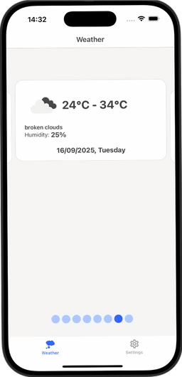
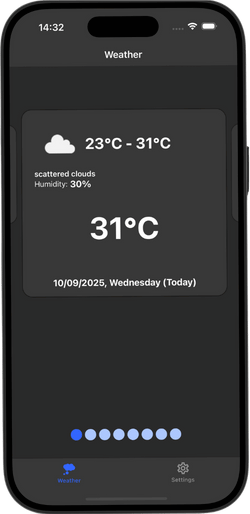

# RNWeather

A React Native mobile application to check daily and weekly weather forecasts, featuring light/dark themes, smooth performance, and a clean TypeScript architecture.  
This project was inspired by the article “Make professional mobile apps with React Native and TypeScript — Introduction” by Thinh Tran:
- [https://thinhtran3588.medium.com/make-professional-mobile-apps-with-react-native-and-typescript-introduction-777ba2423c35](https://thinhtran3588.medium.com/make-professional-mobile-apps-with-react-native-and-typescript-introduction-777ba2423c35)

## Why This Project

- Provide a modern React Native + TypeScript setup, ready to scale.
- Demonstrate a simple and typed global state management (Rematch) with persistence (redux-persist).
- Focus on UX and performance (light/dark theme, fast images, smooth animations).
- Integrate Storybook to develop UI components in isolation.
- Provide a foundation for automated tests (unit/integration) and code quality tools (ESLint + Prettier + Husky).

## Screenshots

<div style="text-align:center;">
  <figure style="display:inline-block; margin: 0 15px;">
    
    <figcaption>🌞 Home – Light Theme</figcaption>
  </figure>
  <figure style="display:inline-block; margin: 0 15px;">
    
    <figcaption>🌙 Home – Dark Theme</figcaption>
  </figure>
</div>

## Main Features

- Daily and weekly weather forecasts with icons and essential data.
- Light/Dark theme persisted across sessions.
- Tab navigation.
- Consistent UI components and theming.
- Performance optimizations: cached images, smooth lists, native animations.
- Basic accessibility (roles, labels, interactions).
- Storybook integration for UI components.
- Tests with Jest and Testing Library.

## Tech Stack

### Language & Runtime
- TypeScript 5
- React 19
- React Native 0.79

### State Management
- Rematch (@rematch/core) as simplified Redux.
- State persistence with @rematch/persist + redux-persist.

### Navigation
- @react-navigation/native
- @react-navigation/bottom-tabs

### UI & Theming
- UI Kitten (@ui-kitten/components)
- Eva Design System (@eva-design/eva, @eva-design/material)
- Safe Area Context
- Vector Icons

### Performance & Animations
- react-native-reanimated
- react-native-fast-image

### Networking & Utilities
- Axios for HTTP requests
- Day.js for date formatting

### Tooling & DX
- Storybook React Native for component isolation
- Jest + @testing-library/react-native
- ESLint + Prettier for code quality
- Husky + lint-staged for pre-commit hooks
- Metro bundler

## High-Level Architecture

- **Global state**: typed Rematch models, clear reducers/effects, selective persistence (e.g., theme preferences).
- **UI layers**: presentational components, screens, tab navigation.
- **Services**: isolated HTTP calls and utilities.
- **Theming**: extended Eva theme with Light/Dark support.

This structure favors scalability, reusability, and testability.

## Requirements

- Node.js >= 18
- Yarn (v4 recommended) or npm
- React Native environment set up (Android Studio/Xcode)

## Getting Started

### Step 1: Install Dependencies
```bash
yarn install
```

### Step 2: Start Metro Bundler
```bash
yarn start
```

### Step 3: Run the App

- **Android**:
```bash
yarn android
```

- **iOS**:
```bash
yarn ios
```
*(On macOS, ensure CocoaPods are installed and run `bundle exec pod install` when native dependencies change.)*

## Useful Scripts

- `yarn lint-check` — Run ESLint check
- `yarn lint` — Run ESLint with auto-fix
- `yarn test` — Run Jest tests
- `yarn coverage` — Run Jest with coverage
- `yarn storybook:ios` — Launch Storybook on iOS
- `yarn storybook:android` — Launch Storybook on Android
- `yarn storybook-generate` — Auto-generate stories

## Storybook

The project integrates Storybook to develop and document UI components in isolation, speeding up collaboration between designers and developers while reducing regressions.

Quick start:
```bash
yarn storybook:ios
yarn storybook:android
```

## Testing

- Jest as test runner.
- @testing-library/react-native for user-oriented testing.
- axios-mock-adapter for API mocks.

Goal: ensure reliability of components, state logic, and critical user flows.

## Code Quality

- ESLint (Airbnb config + React/React Hooks/JSX a11y plugins) and Prettier.
- Husky + lint-staged to enforce lint/format/test on pre-commit.

## Roadmap (Ideas)

- Error handling & retry for weather API calls.
- Offline-first data caching.
- Accessibility improvements and localization.
- E2E testing with Detox.
- Widgets & local notifications (daily forecasts).

## License

This project is provided for educational purposes and as a base for professional mobile apps.  
Consider adding a license according to your needs.  
